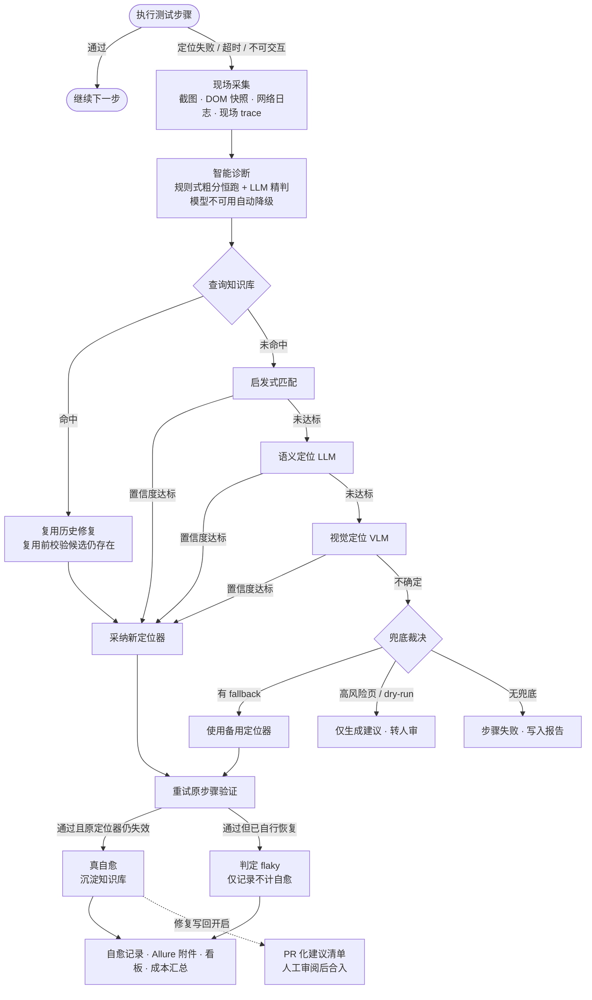

<div align="center">
  <h2>AutoAiSelfHeal</h2>

  <p>
    
    
    
    
    
    
    
    
    <a href="./LICENSE"></a>
  </p>
</div>

<div align="center">

面向 UI 自动化稳定性的 <strong>AI 自愈测试框架</strong>。

在 Playwright 之上构建「感知 → 诊断 → 决策 → 修复」智能闭环：定位失效自动重定位、弹窗突袭自动化解、修复经验沉淀进知识库——<strong>越用越聪明</strong>。

</div>

## 项目预览

> 暂未放置截图。可运行 `python scripts/ab_compare.py` 生成 A/B 对比报告（`reports/ab-compare.md`）、`pytest -m e2e` 后用浏览器打开 `reports/dashboard.html` 自愈看板、`allure serve allure-results` 查看 Allure 报告，截图后补充到本节。

## 核心功能

UI 自动化测试有两大顽疾：**脚本脆弱**——强依赖 ID/XPath 定位，UI 微调即批量失效，团队陷入"抢救式"修复循环；**执行不稳定**——系统弹窗、权限申请等"突袭"让通过率长期徘徊在 ~80%。AutoAiSelfHeal 的全部设计都围绕这两点展开。

### 🔁 多策略自愈闭环

> 定位失败不再直接报错，而是走完「感知 → 诊断 → 决策 → 修复」完整链路，按"由便宜到昂贵"逐级升级。

- **分层诊断** — 规则式根因粗分零成本恒跑；LLM 精判兜底，模型不可用时自动降级规则式，永不阻断主流程。
- **四级策略链** — 知识库指纹精确命中 → 启发式多属性匹配 → 语义定位（DeepSeek）→ 视觉定位（VLM 看图选控件），顺序可配置、策略可插拔。
- **早接受短路** — 任一策略置信度达标即采纳，不再调用后续更贵的模型，省钱省时。
- **置信度裁决** — 各策略产出归一化到统一"采纳概率"标尺，按策略独立阈值裁决；不确定时走 fallback 兜底，无兜底则明确失败。
- **弹窗守卫与智能等待** — 系统弹窗 / 权限申请自动化解，动作前置短稳等待，缓解"元素抖动就点"的误报超时。
- **双来源交叉校验** — 候选定位器经静态 DOM 解析与 Playwright 原生查询双重验证，拒绝模型幻觉。

### 🧠 知识库沉淀，越用越聪明

> 调用大模型前先查知识库：命中直接复用，把每一次修复变成零边际成本的经验资产。

- **修复案例沉淀** — 自愈验证成功后，「原定位器 → 新定位器 → 置信度」写入 SQLite。
- **语义检索复用** — 本地确定性 n-gram 向量（零 API 费用、毫秒级）+ 余弦相似度，相似场景直接命中历史修复；ID 变了但文本 / 结构不变仍能命中。
- **失效防护** — 复用前先验证候选 selector 仍真实存在，失效即转人审清单，绝不白用过期缓存。
- **价值实证** — 同一组 3 个失效场景双轮对比：关闭自愈 0/3 通过（人工修复 3 次）vs 开启自愈 3/3 通过（0 干预），自愈成本约 ¥0.09。复现：`python scripts/ab_compare.py`。

### 🧩 插件化零侵入

> 自愈以 pytest 插件形式存在，POM 代码一行不改，开 / 关自愈同一份代码都能跑。

- **接口兼容代理** — `HealingPage` 完全代理原生 Page；关闭自愈时就是原生 Page，零开销。
- **fixture 注入** — `pom` / `healing_page` 双 fixture 按需注入，CLI `--selfheal` / `--no-selfheal` 优先于配置文件。
- **增强参数按需透传** — `description`（语义描述）与 `fallback`（备用定位器）原生 Page 下不传即可。
- **被测系统零成本迁移** — 从自建演示页迁移到真实 ERP（管伊佳，Vue3 + Ant Design Vue），框架四层零改动，只动测试层。

### 🛡️ 风险控制与人审闸门

> 自愈是提效助手，不是无人值守的自动改码机——每一步都留有闸门。

- **高风险页豁免** — URL glob 命中（如支付 / 强授权 / 审计页）即不触发自愈。
- **dry-run** — 仅生成修复建议，不换定位器、不落库。
- **修复写回人审** — 成功修复输出「原 → 新」PR 化建议清单；CI 自动开草稿 PR，只审不合。
- **真自愈 vs flaky** — 修复后原定位器仍失效 = 真修复，已自行恢复 = flaky 侥幸，看板分开统计不掺水。
- **成本看板** — LLM/VLM 调用次数与估算费用汇总，多模态花钱心里有数。

### 📊 全链路证据与可观测

> 每次自愈都留下可回放、可审计的完整现场。

- **四合一现场采集** — 截图、DOM 快照、网络日志、现场内联 trace 一次抓取。
- **双 trace 体系** — 整用例 Trace 与失败现场内联 trace，`playwright show-trace` 交互式回放（DOM + 操作时间线）。
- **Allure 报告** — 环境页、自愈标签分组、自愈记录 / trace 附件，CI 发布 GitHub Pages 含历史趋势。
- **自研 HTML 看板** — 自愈记录、真自愈 vs flaky 区分、成本汇总一屏看清。
- **CI 两阶段门禁** — unit（不依赖浏览器）先全绿，e2e 才运行；main 回归失败 webhook 告警（钉钉 / 企微 / Slack）。

## 系统流程



## 技术栈

| 层次 | 技术 | 作用 |
| :--- | :--- | :--- |
| 自动化底座 | Python 3.10+、Playwright、pytest、pytest-playwright | 执行引擎、用例组织与 fixture 注入 |
| AI 自愈 Agent | 自研 orchestrator / diagnose / strategies | 编排「感知 → 诊断 → 决策 → 修复」闭环与多策略修复 |
| 模型接入 | DeepSeek（LLM）、通义 qwen3-vl-plus（VLM）、llm/ 抽象层 | 语义定位、根因精判与截图视觉定位；provider 无关，切换只改配置 |
| 知识库 | SQLite + numpy 本地向量 | 修复案例沉淀与语义检索，零 API 费用 |
| 现场采集 | BeautifulSoup4、Playwright Tracing | DOM 快照解析与 trace 录制回放 |
| 配置管理 | pydantic、PyYAML、python-dotenv | 集中加载校验，密钥只存环境变量 |
| 测试报告 | Allure、自研 HTML 看板 | 自愈审计、成本汇总与历史趋势 |
| 质量与 CI | ruff、pytest-xdist、GitHub Actions | Lint 与格式化、并行执行、两阶段流水线与报告发布 |

## 快速开始

### 环境要求

| 组件 | 要求 | 说明 |
| :--- | :--- | :--- |
| Python | ≥ 3.10 | 框架运行环境 |
| Chrome | 系统已装 | 默认 `channel: chrome` 直连系统浏览器，免下载内核 |
| API Key | 可选 | `OPENAI_API_KEY`（DeepSeek）与 `DASHSCOPE_API_KEY`（通义）；未配置时自动降级：诊断退规则式、语义与视觉策略跳过 |
| allure CLI | 可选 | 本地查看 Allure 报告（依赖 Java）；CI 报告发布 GitHub Pages，无需本地安装 |

### 常见命令

```bash
pytest -m unit                      # 单元测试（CI 门禁，不依赖浏览器）
pytest -m e2e                       # 端到端测试（自愈闭环 / 弹窗 / 智能等待等场景）
pytest -m e2e --selfheal            # 显式开启自愈（--no-selfheal 关闭）
pytest -m e2e --trace-healing       # 运行并录制 Playwright Trace
pytest --alluredir=allure-results   # 生成 Allure 结果
ruff check .                        # Lint（格式化：ruff format .）
```

### 1. 安装框架

```bash
git clone <your-repo-url>
cd AutoAiSelfHeal
python -m venv venv
source venv/bin/activate            # Windows: venv\Scripts\activate
pip install -e ".[dev,llm]"
```

默认使用系统已装 Chrome，无需下载浏览器内核；如需 Playwright 自带 Chromium：

```bash
playwright install chromium
```

并把 `config/settings.yaml` 的 `browser.channel` 改为 `chromium`。

### 2. 准备配置

```bash
cp config/settings.example.yaml config/settings.yaml
```

在项目根目录创建 `.env`（已被 gitignore，绝不入库），填入模型密钥：

```text
OPENAI_API_KEY=sk-xxx      # DeepSeek（LLM）
DASHSCOPE_API_KEY=sk-xxx   # 通义百炼（VLM）
```

未配置密钥也能跑：诊断自动退规则式、语义与视觉策略跳过，启发式匹配与知识库复用照常工作。

### 3. 运行测试与自愈演示

```bash
pytest -m unit                    # 单元测试，秒级完成
pytest -m e2e                     # 自愈闭环 / 弹窗 / 智能等待等场景
python scripts/ab_compare.py      # A/B 实证：关闭 vs 开启自愈（产出 reports/ab-compare.md）
```

e2e 自带自愈演示：`tests/e2e/pages/demo_page.html` 模拟"前端改版"（运行时改输入框 id）→ 旧定位器失效 → 多策略自愈重定位，覆盖自愈成功 / 兜底 / 关闭 = 原生三种场景。

在真实 ERP 上体验自愈（可选，需本地被测环境）：

```bash
pytest tests/e2e/test_erp_healing.py -m erp -v
```

前置：`.env` 配置 `ERP_USERNAME` / `ERP_PASSWORD`（租户账号）、ERP 前后端已启动且登录验证码关闭；CI 自动排除 erp 用例。

### 4. 查看报告

```bash
allure serve allure-results                             # Allure 报告（需 allure CLI）
playwright show-trace reports/traces/trace-<test>.zip   # Trace 交互式回放
```

自愈看板无需安装：直接用浏览器打开 `reports/dashboard.html`。

### 5. 写一个带自愈的 POM 用例（可选）

POM 只依赖 `page` 接口——注入原生 page 或带自愈的 `healing_page`，同一份代码都能跑：

```python
from selfheal.engine.base_page import BasePage


class LoginPage(BasePage):
    url = "https://example.com/login"

    def login(self, user="tester", pwd="secret") -> None:
        # description 让自愈凭语义重定位；fallback 提供人工备用定位器
        self.locator('[data-testid="username"]', description="用户名输入框").fill(user)
        self.locator("#submit", description="登录按钮", fallback="#submit-v2").click()
```

```python
def test_login(healing_page):
    page = LoginPage(healing_page)   # 换成 pom fixture 即关闭自愈
    page.open()
    page.login()
```

## 目录结构

```text
AutoAiSelfHeal/
├── config/
│   └── settings.example.yaml    # 运行时配置示例（复制为 settings.yaml 使用）
├── src/selfheal/                # 框架主体（四层）
│   ├── engine/                  #   能力建设层：Playwright 封装 / 自愈定位器 / 智能等待 / 弹窗处理
│   ├── collect/                 #   数据采集层：截图 / DOM 快照 / 网络日志 / 现场 trace
│   ├── agent/                   #   AI 自愈 Agent：编排闭环 / 诊断 / 多策略修复
│   │   ├── strategies/          #     可插拔修复策略：启发式 / 语义 / 视觉
│   │   └── dom/                 #     DOM 解析 / 指纹 / 候选生成
│   ├── llm/                     #   模型抽象层：LLM + VLM，provider 无关
│   ├── knowledge/               #   知识库：SQLite 修复案例与弹窗特征
│   └── reporting/               #   展示层：Allure 桥 / 自愈看板 / 修复建议
├── tests/
│   ├── unit/                    # 单元测试（CI 门禁，不依赖浏览器）
│   └── e2e/                     # 端到端测试（自愈闭环 / 弹窗 / ERP 等）
├── scripts/                     # A/B 对比 / 语义复用演示 / 通知 / 草稿 PR
├── docs/                        # architecture.md · roadmap.md · TODO.md
└── .github/workflows/ci.yml     # CI：unit 门禁 → e2e → 报告发布 / 草稿 PR / 告警
```

## 常见问题

| 现象 | 处理方式 |
| :--- | :--- |
| 提示找不到 Chrome，或想用 Chromium | `playwright install chromium`，并把 `config/settings.yaml` 的 `browser.channel` 改为 `chromium` |
| 没配 API Key 能跑吗 | 能。诊断退规则式，语义与视觉策略跳过；启发式、知识库复用与 fallback 照常工作 |
| 定位失败但没触发自愈 | 检查是否带 `--selfheal`（或 `settings.healing.enabled: true`）；确认 URL 未命中 `healing.exclude_url_patterns` 豁免 |
| `settings.yaml` 加键后启动报错 | 配置按 pydantic 严格校验（未建模键禁止），以 `config/settings.example.yaml` 为准 |
| 想重置知识库 | 删除 `.cache/knowledge.db` 即可，下次运行自动重建 |
| Allure 报告打不开 | 本地需安装 allure CLI（依赖 Java）；或直接浏览器打开 `reports/dashboard.html` 自愈看板 |
| ERP 用例如何运行 | 本地启动 ERP 前后端，`.env` 配 `ERP_USERNAME` / `ERP_PASSWORD`，被测环境关闭登录验证码；CI 不跑 erp 用例 |

## 开源说明

本项目基于 [MIT License](LICENSE) 开源。
